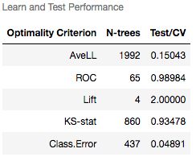

# spm_kernel
Jupyter kernel for Salford Predictive Modeler (SPM)

The SPM kernel provides a way to conduct analyses in SPM from the comfort of
one's own web browser.

## What do I need to run it?

* Non-GUI SPM 8.x (<https://www.salford-systems.com/products/spm>).
  GUI SPM will not work because it does not accept commands via
  standard input or send results to standard output.  The SPM executable
  must be in the path and named "spmu".  SPM must be licensed separately
  from Salford Systems.

* Python 3.6 or higher (<https://www.python.org/>).  If you are running
  under Microsoft Windows, you will need a native Python interpreter
  (such as that distributed with [Anaconda](https://www.anaconda.com)).
  The [Cygwin](http://cygwin.com/) version will not work because the
  SPM `>` prompt is not displayed when SPM runs under Cygwin.  Python is
  part of most Linux distributions, so if you plan to run under Linux,
  you can probably use your distribution's package manager to install
  Python 3 if it is not installed already.

* Prerequisite Python packages.  These will be installed automatically
  when you install spm-kernel, but you'll probably want to install them
  at the system level instead of the user level if you can.  The list
  includes `IPython`, `pexpect`, `xmltodict`, `numpy`, `pandas`, `matplotlib`,
  and `ordered_set`.

* Jupyter (<https://jupyter.org/>).

## How do I install it?

Install via pip as follows:

`pip3 install spm-kernel`

In case of permission issues, use:

`pip3 install --user spm-kernel`

To update an existing installation, use:

`pip3 install --upgrade spm-kernel`

...or...

`pip3 install --upgrade --user spm-kernel`

Once the kernel is installed into Python, it needs to be installed into
Jupyter, as follows:

`python3 -m spm_kernel install`

Add the `--user` flag after `install`, if needed.

## How do I use it?

1.  Start the Jupyter notebook server.  This can be done by typing
  `jupyter notebook` at your preferred command prompt, or if there is an
  appropriate item in your menuing system, you can start it that way.
  You can start a console instead, but then you can't save your notebook.

2.  Assuming that you are running the notebook server, you might see a
  session automatically start in your favorite web browser.  If not, you can
  start a session manually by following the instructions printed when
  the server starts.  The message will look something like this:
  ```
    To access the notebook, open this file in a browser:
        file:///run/user/1000/jupyter/nbserver-12067-open.html
    Or copy and paste one of these URLs:
        http://localhost:8888/?token=d52a084d6494bf65eba6731b51da81c03405b3b9f4d5f59f
  ```
  If you do not want a browser session to start automatically, then specify the `--no-browser` flag.

  If you want the server to be accessible to external clients, then specify the IP address to which
  you want clients to connect with the `--ip` flag.  By default, the IP address used is 127.0.0.1
  (localhost) which is not accessible to external clients.

  In Mozilla Firefox, the session will look like this:
  

3.  Click on the "New" button.  You wil see something like this:
  

4.  Select "SPM".  A new tab or window will open, showing something like this:
  

5.  At this point, you can enter any command supported by SPM, click on "Run"
  and the results will appear below the command, like so:
  
  The commands can be run in any order that makes sense.

6.  To give your notebook a name, Click on "File:Save As", like so:
  
  The resulting file will bear the name given plus the ".ipynb" extension
  and can be opened later, as desired.  Any output will be saved along with
  the commands and any further changes to the notebook will be saved
  automatically.

All commands supported by SPM are supported the kernel and mostly work in
the same way.  The exceptions are as follows:

* The `ECHO` command has no effect on the underlying SPM session, but merely
  enables or suppresses output in the notebook.

* `TRANSLATE LANGUAGE=PLOTS` (without the `OUTPUT` option) actually displays
  any one way partial dependency plots generated when a TreeNet model is
  built.  This command is not relevant to other model types and at present,
  two way plots are not displayed.

* The `SUBMIT` command automatically invokes `ECHO ON` in the underlying
  SPM session when it completes.  This is done because  spm_kernel relies
  on the `>` prompt to determine when a command has completed.

* The `QUIT` command terminates the underlying SPM session as expected,
  closing any open files; but also starts a new one.

SPM BASIC is fully supported.

SPM's internal command reference is available via the `HELP` command.
The web-based documentation for SPM can be accessed at
<https://www.salford-systems.com/support/spm-user-guide/help>.

Three additional commands are supported as follows:

* `$VARIMP` will display the variable importance report from the most
  current model or `AUTOMATE` battery in the form of a bar graph.
  In the latter case, the variable importances are averaged across all models
  built.  It should be noted that the `HARVEST` command has no effect on this
  one.

* `$AUTOSUM` displays the summary table for the current `AUTOMATE` battery.
  It has no effect if an `AUTOMATE` battery is not in memory.  On shaving
  batteries, if more than five predictors are shaved at a time, the number
  of variables shaved will be displayed, rather than the individual names.
  This will be made configurable in a future version of spm_kernel.

* `$SUMMARY` displays first a table showing the best performance statisics for each subset of the
  current model (where applicable) followed by plots of each tracked performance statistic by subset
  size.  This is currently only supported for single TreeNet models.  Here is an example table:

.

And here is an example plot:


The SPM kernel inherits its
[magics](https://ipython.readthedocs.io/en/stable/interactive/magics.html)
from the [Metakernel](https://github.com/Calysto/metakernel) on which it is
based without adding any additional ones.

## How do I get help?

For now, open an issue at <https://github.com/jlries61/spm_kernel>.  Every
reasonable effort will be made to address reported issues promptly.

## How do I help?

Contact [me](https://github.com/jlries61) and we'll talk.
